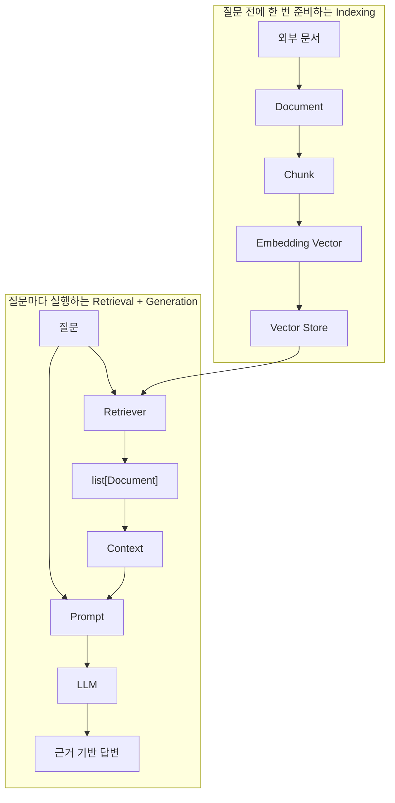

# 1. LLM

## Pre-Training
```
데이터 -> 학습 -> 파라미터 변경 -> 다음 요청에 영향 O
```

## ICL(In-Context Learning)
```
프롬프트에 지시사항 포함 -> 파라미터 변경 X -> 다음 요청 영향 X

ex) one-shot, few-shot 등
```

## LLM이 틀리는 이유
질문에 대한 답변을 확률이 제일 높은 token을 선택하는 방식으로 대답한다.
그러다보니 
학습한 데이터에 없거나, 오래된 정보, 애매한 질문, 부족한 근거에대해
그럴듯한 오답을 발생시킨다

## 보완 방법
- Prompt: 모르면 모른다고 답하게 하기
- RAG: 관련 문서를 검색해서 근거로 제공
- Tool: 날씨, 특정 기관의 데이터 등 학습되지 않은 데이터를 
        외부 API 시스템을 이용해서 조회
- FineTuning: 기존 모델에 업무와 관련된 양질의 데이터를 추가 학습

---

## Prompt 작성 기법
- Zero-shot
- One-shot
- Few-shot
- CoT
- ReAct

---

# 2. OpenAI API 기능 
- Chat Completions : 채팅
- Responses API : 채팅
- Embeddings : 벡터화
- TTS : 텍스트 -> 음성
- STT : 음성 -> 텍스트
- Function Calling : LLM이 로컬 서버의 함수를 요청


---

## 용어 정리

- Corpus(말뭉치): NLP 모델 학습/분석을 위한 대규모 텍스트 데이터 집합
- Sentence(문장): 텍스트 한 줄 또는 한 문장
- Word(단어): 공백 기준으로 나눠진 글자모음
- Token: 모델이 텍스트를 처리하기 위해 
         더 이상 쪼개질수 없도록 분할한 최소 처리 단위 
- Embedding: 텍스트 형태의 토큰을 모델이 계산할 수 있는 형태의
             고차원 실수 벡터로 변한한 숫자 표현

---

# 3. LangChain
- Prompt, Model(LLM), Retriever, Tool, Parser 등을
  공통된 인터페이스로 연결하는 LLM 애플리케이션 프레임워크.

## LangSmith
- LangChain 객체의 분기, 반복, 상태 등의 trace를 기록하고
 모니터링 할 수 있는 플랫폼

## LangGraph
- LangChain 코드를 그래프 형식으로 구성하는 것.
- 좀 더 세밀한 제어/조작이 가능함

## Runnable, Chain
- Runnable: 입력을 받아 작업을 수행하고, 출력을 반환하는 공통 실행 단위.
            반환된 출력은 다음 Runnable의 입력이 된다.

- Chain: Runnable을 둘 이상 연결한 전체 처리 경로

- Runnable 입력 메서드
  - invoke() : 입력 하나를 처리해 결과 하나를 반환
  - batch()  : 여러 독립 입력을 처리해 입력 순서와 대응하는 결과 목록 반환
  - stream() : 입력 하나를 처리해 생성되는 chunk 단위로 출력

- LCEL(LangChain Expression Language)
  - `|` : 왼쪽 출력이 오른쪽 입력이 되도록 연결
  - RunnableSequence ==  `|
  - RunnableLambda: 일반 함수 -> Runnable
  - RunnableParallel: 같은 입력을 여러 분기에 보내어 병렬 처리
  - RunnablePassthrough: 원본 입력을 다음 단계로 전달
  - RunnableBranch: 조건에 따라 수행할 Runnable 선택
  - RunnableGenerator: upstream chunk를 도착하는 순서대로 변환
    - upstream chunk: 이전 단계 Runnable

## 대화 이력 (Message 객체)
- SystemMessage: LLM 지침
- HumanMessage: 사용자 입력
- AIMessage: LLM 처리 결과
- ToolMessage: Agent가 호출한 도구(함수)의 결과

## Agent
- LLM + Tool
- LLM이 단순한 문장 생성을 넘어
  스스로 판단하고, 외부 도구(Tools)를 사용해 복잡한 문제를 해결하는
  자율적 주체를 의미함.
  -> LLM이 목표를 달성하기 위해 어떤 과정을 거치고, 
     도구를 사용할지 스스로 결정

### Agent 구성 요소
- LLM(Brain) : 추론, 의사결정, 응답을 담당
- Tool(Hands & Feet): 에이전트가 외부 API 등과 상호 작용하게 만들어줌
- Memory(Context): 이전 대화 내역, 중간 실행 결과를 기억

---

## 4. Retrieval, RAG
- Retrieval: 검색 과정 
  - Vector Store/Corpus 에서 질문(query)와 관련된 정보를 
    찾아오는 행위 또는 전체 메커니즘

- Retriever: 검색 객체(검색기)
  - Retrieval(검색 과정)을 수행하는 LangChain 객체

- RAG(Retrieval Augmented Generation)
  - 관련 외부 문서를 검색(Retrieval)하고 
    그 문서를 LLM의 응답 생성 근거로 제공(Augmented)하는 방식




## 5. Retrieval Optimization
1. Indexing - ids, upsert
2. BM25, DENSE
3. RRF (순위 역수 결합)
4. Metadata Filtering
5. Self-query Retriever: 자연어 입력 -> LLM이 필터링할 메타데이터 추출

